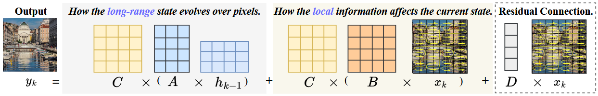
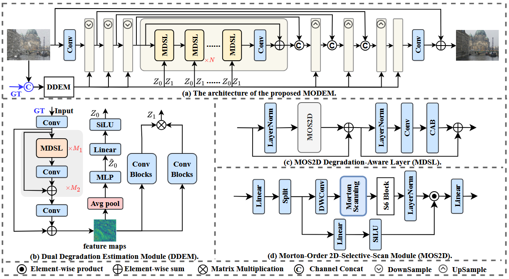
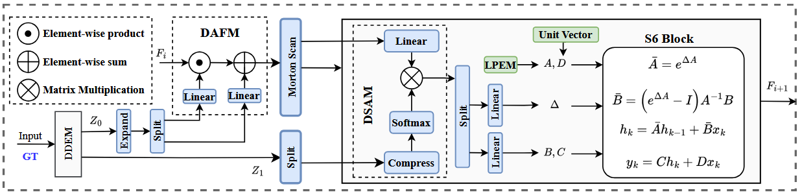
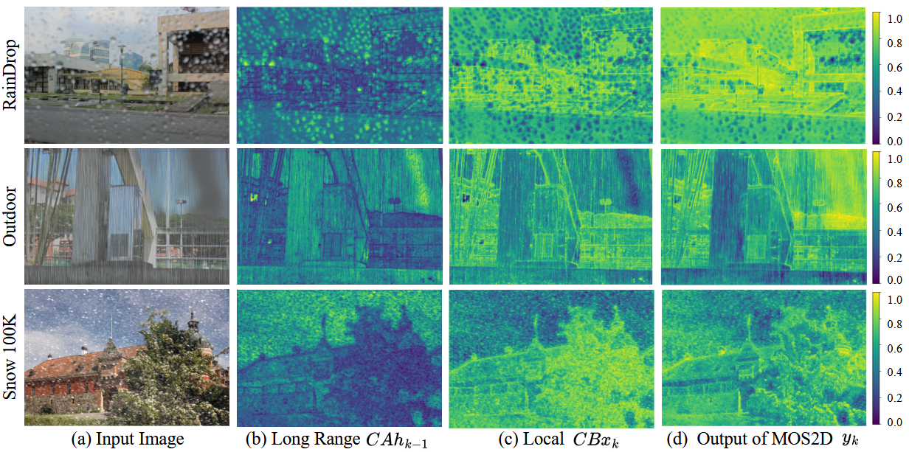

<div align="center">
  <h1>[NeurIPS 2025] MODEM: A Morton-Order Degradation Estimation Mechanism for Adverse Weather Image Recovery</h1>
  Offical implementation for "MODEM: A Morton-Order Degradation Estimation Mechanism for Adverse Weather Image Recovery".
  <br>
  <a href="https://neurips.cc/virtual/2025/poster/115258"></a>
  <a href="https://arxiv.org/abs/2505.17581"></a>
  <a href="https://neurips.cc/virtual/2025/poster/115258"></a>
  <br>
  <a href="https://scholar.google.com/citations?user=Z2RcbF4AAAAJ&hl">Hainuo Wang</a> •
  <a href="https://scholar.google.com/citations?user=4zasPbwAAAAJ&hl">Qiming Hu</a> •
  <a href="https://scholar.google.com/citations?user=RL7jPuQAAAAJ&hl">Xiaojie Guo</a>*
  <br>
  College of Intelligence and Computing, Tianjin University
</div>

## 📖 Method

<p align="center">
  
  <br>
  <i>Fig. Connection between MODEM and SSM.</i>
</p>
<p align="center">
  
  <br>
  <i>Fig. (a) Overall architecture of MODEM. (b) The DDEM for extracting global descriptor Z<sub>0</sub> and adaptive degradation kernel Z<sub>1</sub> degradation priors. (c) The MDSL incorporating the core MOS2D module (d) within a residual block. The blue-colored components indicate elements exclusive to the first training stage. N, M<sub>1</sub>, M<sub>2</sub> denote the number of the corresponding module, respectively.</i>
</p>
<p align="center">
  
  <br>
  <i>Fig. Detailed illustration of the degradation modulation mechanism within a MOS2D module in the main restoration backbone, which employs the Degradation-Adaptive Feature Modulation (DAFM) and Degradation-Selective Attention Modulation (DSAM) to dynamically adjust feature representations based on the degradation priors Z<sub>0</sub> and Z<sub>1</sub>.</i>
</p>
<p align="center">
  
  <br>
  <i>Fig. With respect to a sample (a), (b)-(d) visualize the long-range CAh<sub>k-1</sub>, (c) local CBx<sub>k</sub>, and (d) output of MOS2D y<sub>k</sub>, respectively.</i>
</p>

## 📈 Performance

<div align="center">
Table: Quantitative comparison with recent state-of-the-art unified methods across various datasets.

| Methods | Snow100K-S | Snow100K-L | Outdoor | RainDrop | Average |
|---|---|---|---|---|---|
| | PSNR SSIM | PSNR SSIM | PSNR SSIM | PSNR SSIM | PSNR SSIM |
| All-in-One | - - | 28.33 0.8820 | 24.71 0.9890 | 31.12 0.9268 | 28.05 0.9023 |
| TransWeather | 32.51 0.9341 | 29.31 0.8879 | 28.83 0.9000 | 30.17 0.9157 | 30.21 0.9094 |
| Chen et al. | 34.42 0.9469 | 30.22 0.9071 | 29.27 0.9147 | 31.81 0.9309 | 31.43 0.9249 |
| WGWSNet | 34.31 0.9460 | 30.16 0.9007 | 29.32 0.9207 | 32.38 0.9378 | 31.54 0.9263 |
| WeatherDiff | 35.83 0.9566 | 30.09 0.9041 | 29.64 0.9312 | 30.71 0.9313 | 31.57 0.9308 |
| WeatherDiff<sub>128</sub> | 35.02 0.9516 | 29.58 0.8941 | 29.72 0.9216 | 29.66 0.9225 | 31.00 0.9225 |
| AWRCP | 36.92 0.9652 | 31.92 **0.9341** | 31.39 0.9329 | 31.93 0.9314 | 33.04 0.9409 |
| Histoformer | 37.41 0.9656 | 32.16 0.9261 | 32.08 0.9389 | **33.06** **0.9441** | 33.68 0.9437 |
| MODEM (Ours) | **38.08** **0.9673** | **32.52** 0.9292 | **33.10** **0.9410** | 33.01 0.9434 | **34.18** **0.9452** |

Table: Comparison of perceptual metrics, including referenced (LPIPS↓) and non-referenced (Q-Align↑, MUSIQ↑) scores.

| Method | Snow100K-L | Snow100K-S | Outdoor | Raindrop | Snow100K-Real |
|---|---|---|---|---|---|
| **LPIPS** | | | | | |
| Histoformer | 0.0919 | 0.0445 | 0.0778 | 0.0672 | - |
| WeatherDiff | 0.0982 | 0.0541 | 0.0887 | **0.0615** | - |
| MODEM (Ours) | **0.0880** | **0.0407** | **0.0699** | 0.0650 | - |
| **Q-Align** | | | | | |
| Histoformer | 3.7207 | 3.7598 | 4.1445 | 4.0156 | 3.5449 |
| WeatherDiff | 3.4531 | 3.5293 | 3.8691 | 4.0000 | 3.4512 |
| MODEM (Ours) | **3.7324** | **3.7695** | **4.1875** | **4.0664** | **3.5586** |
| **MUSIQ** | | | | | |
| Histoformer | **64.2526** | 64.2581 | 67.7461 | 68.4582 | 59.4040 |
| WeatherDiff | 62.6267 | 63.1729 | 67.4814 | 69.3608 | 59.4493 |
| MODEM (Ours) | 64.2438 | **64.2853** | **68.2926** | **69.7925** | **59.6042** |

Table: Comparison of different methods on various real-world datasets using the Q-Align metric.

| Method | Snow100K-Real | RainDrop | NTURain | RESIDE | WeatherStream |
|---|---|---|---|---|---|
| WeatherDiff | 3.4531 | 4.0000 | 3.2031 | **3.4219** | 1.9561 |
| Histoformer | 3.7207 | 4.0156 | 3.2266 | 3.2891 | 1.9434 |
| MODEM (Ours) | **3.7324** | **4.0664** | **3.2891** | 3.3164 | **1.9863** |
</div>

## 🌠 Environment Setup

1.  **Clone the repository:**
    ```bash
    git clone https://github.com/your_username/MODEM.git
    cd MODEM
    ```

2.  **Create a conda environment:**
    ```bash
    conda create -n modem python=3.10
    conda activate modem
    ```

3.  **Install dependencies:**
    ```bash
    pip install torch==2.1.0 torchvision==0.16.0 torchaudio==2.1.0 --index-url https://download.pytorch.org/whl/cu121
    pip install matplotlib scikit-learn scikit-image opencv-python yacs joblib natsort h5py tqdm
    pip install einops gdown addict future lmdb numpy pyyaml requests scipy yapf lpips tensorboardX
    pip install tb-nightly -i https://mirrors.aliyun.com/pypi/simple
    pip install https://github.com/state-spaces/mamba/releases/download/v2.0.4/mamba_ssm-2.0.4+cu122torch2.1cxx11abiFALSE-cp310-cp310-linux_x86_64.whl
    pip install timm==0.4.12
    pip install transformers==4.28.0
    pip install "numpy<2"
    ```

4.  **Install `basicsr`:**
    ```bash
    python setup.py develop
    ```

## 💾 Datasets and Pre-trained Models

Download the required datasets for training and testing. [[Google Drive](https://drive.google.com/file/d/1QkffXDt2EaRGxhKaVvgZ_ZP-AuQdP5dh/view?usp=drive_link)]

Download the pre-trained models for evaluation. [[Google Drive](https://drive.google.com/drive/folders/1p7DyLvDSilU12YSaOxYTkUfoxrdK0qi7?usp=sharing)]

- **MODEM Stage 1**: `modem_stage1.pth`
- **MODEM Stage 2**: `modem_stage2.pth`

## 💡 Training

To train the model, run the following command:

```bash
CUDA_VISIBLE_DEVICES=0,1,2,3 \
OMP_NUM_THREADS=4 torchrun --nproc_per_node=4 --master_port=4323 basicsr/train.py -opt options/modem_stage2.yml --launcher pytorch
```

Before running, you may need to adjust the `CUDA_VISIBLE_DEVICES` and other parameters in the script and the configuration file (`options/modem_stage2.yml` or `options/modem_stage2.yml`) according to your setup. According to our configuration file, you need 4 GPUs for training. (We used 4 NVIDIA RTX 3090.)

## ✅ Testing

To test the model, use the `test.py` script. You need to provide the path to the checkpoint, input images, ground truth images, and the output directory.

```bash
python test.py --ckpt_path /path/to/your/checkpoint.pth \
               --input_folder /path/to/your/input_images \
               --gt_folder /path/to/your/gt_images \
               --output_folder /path/to/your/output_directory
```

The script will save the restored images and print the average PSNR and SSIM values.

## 📝 Citation

If you find this work useful for your research, please cite our paper:

```bibtex
@article{wang2025modem,
  title={MODEM: A Morton-Order Degradation Estimation Mechanism for Adverse Weather Image Recovery},
  author={Wang, Hainuo and Hu, Qiming and Guo, Xiaojie},
  journal={arXiv preprint arXiv:2505.17581},
  year={2025}
}
```

## 🙏 Acknowledgement

We would like to thank [Mingjia Li](https://github.com/lime-j ) for the insightful discussions and feedback. We are grateful for the computational resource support provided by Google's TPU Research Cloud. This code is based on the [BasicSR](https://github.com/XPixelGroup/BasicSR), [MambaIR](https://github.com/csguoh/MambaIR), [VMamba](https://github.com/MzeroMiko/VMamba) and [Histoformer](https://github.com/sunshangquan/Histoformer). Thanks for their awesome work.
